# Dshield-Honeypot-AWS-setup
ATTENTION: If you are here becuase of your raspberrypi install reports that your webserver is not exposed (like how mine was), please check this [guide](https://github.com/DShield-ISC/dshield/blob/main/docs/dshield-architecture/Architecture.md) first. =D
****
Here we will walkthrough:
1) [Installing the Dshiled honeypot in an AWS instance](https://github.com/SomeTech01/Dshield-Honeypot-AWS-setup)
2) [Setting up an ELK stack on another device for log analysis]()
3) [Setting up your filebeat as a forwarder]()

Fellow Sans.edu student or enthusiast, you will first need an AWS account to proceed. Registering for one will not be covered here, but here is a [link](https://docs.aws.amazon.com/lex/latest/dg/gs-account.html) to Amazon's documentation.

You will also need to register a [dshield account](https://dshield.org/) to have an API key and visibility of what you are forwarding to the Storm Center.

I was able to put this together by using instructions/guides from [Dr. Johannes Ullrich](https://www.youtube.com/watch?v=fMqhoNnyvmE) the founder of Internet Storm Center, [Guy Bruneau](https://github.com/bruneaug/DShield-SIEM?tab=readme-ov-file) my ISC handler, and [15HzMonitor](https://github.com/15HzMonitor/Internship-Blog-Post/blob/main/1.%20AWS%20DShield%20Sensor%20Setup.md) a fellow student (if you ever read this please correct me if I'm wrong)

****
1) After logging in and selecting your region, punch in ec2 in the search bar an click on click <span style="color:cyan;">EC2</span> under Services. When re-directed, click <span style="color:cyan;">Launch Instance</span>


2) Pick a <span style="color:cyan;">name</span> for your instance. Choose <span style="color:cyan;">Ubuntu</span> for you OS, <span style="color:cyan;">Ubuntu Server 22.04 LTS</span> for the machine image, and <span style="color:cyan;">t2.micro</span> for instance type


3) scroll down to see options on creating your ssh key. Click on <span style="color:cyan;"> Create new key pair</span>. Pick a <span style="color:cyan;">Key pair name</span>, <span style="color:cyan;">RSA</span> for key pair type, <span style="color:cyan;">PEM</span> for key file format and then click <span style="color:cyan;">Create key pair</span>. <span style="color:red;">__Save it somewhere safe__</span> we'll use this shortly.


4) even further under <span style="color:cyan;">Network settings</span>, choose <span style="color:cyan;">Create securtiy group</span> and <span style="color:cyan;">Allow SSH traffic</span> (yes it says anywhere we'll deal with that in a bit)

5) For <span style="color:cyan;">storage </span> put in <span style="color:cyan;">30</span>. You should see a message saying that this eligible for free tier customers

6) check the <span style="color:cyan;">Summary</span> and click <span style="color:cyan;">Launch Instance</span>. You should see a pop-up confimation.

7) On the left handside click on <span style="color:cyan;">Instances</span> > <span style="color:cyan;">tick box for your instnace</span> >
 <span style="color:cyan;">Public IPv4 address</span>


8) open powershell on your pc and type in: 

```bash
ssh -i sshkey user@YourInstanceIP
```

9) First and foremost you have to update your box:
```bash
sudo apt update && sudo apt full-upgrade -y
```
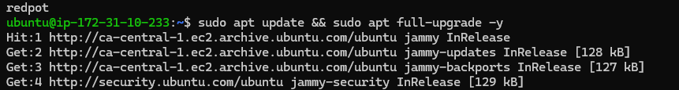
10) Once done, time to install our honeypot. First make a directory to clone the repository. Once the repository is cloned we'll have to run the install script.
```bash
mkdir install
cd install
git clone https://github.com/DShield-ISC/dshield.git
sudo ./dshield/bin/install.sh
```
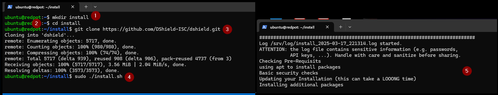
11) Follow the prompt. You will need your <span style="color:cyan;">email registered with dshield</span>,  <span style="color:cyan;">API key</span>, and <span style="color:cyan;">IP's + ports for the configuration</span> (last bit autofilled for me you'll just have to double check)
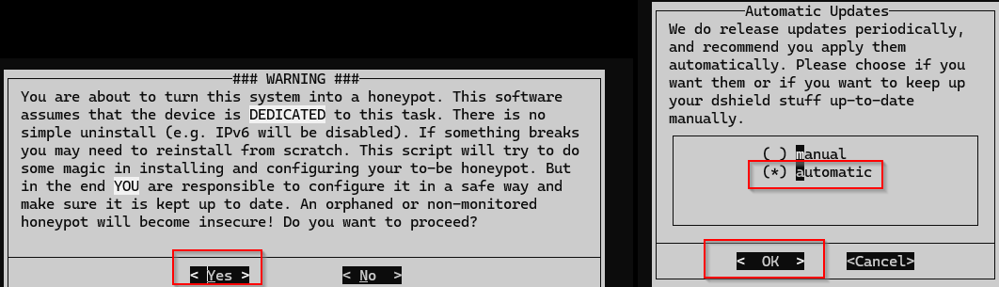
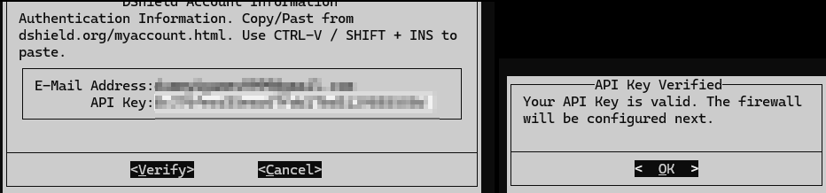
12) After the process is done you will be asked to <span style="color:cyan;">reboot</span>. Take note of the <span style="color:cyan;">new ssh port</span> and additional scripts like <span style="color:cyan;">status.sh and cleanup.sh <span>
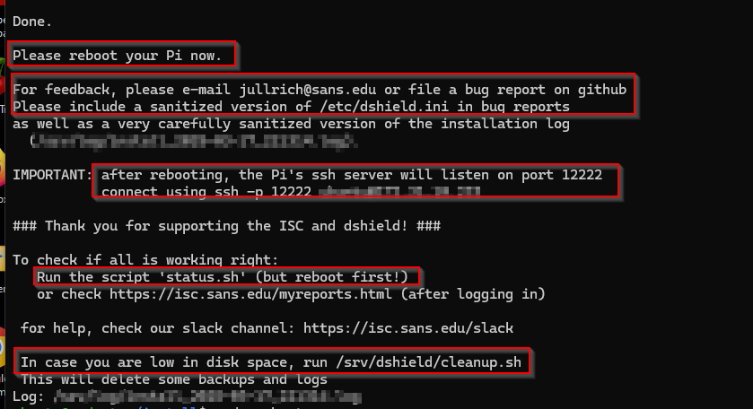


13) Before turnng on your instance got to the <span style="color:cyan;">Security</span> tab > <span style="color:cyan;">Security groups </span>
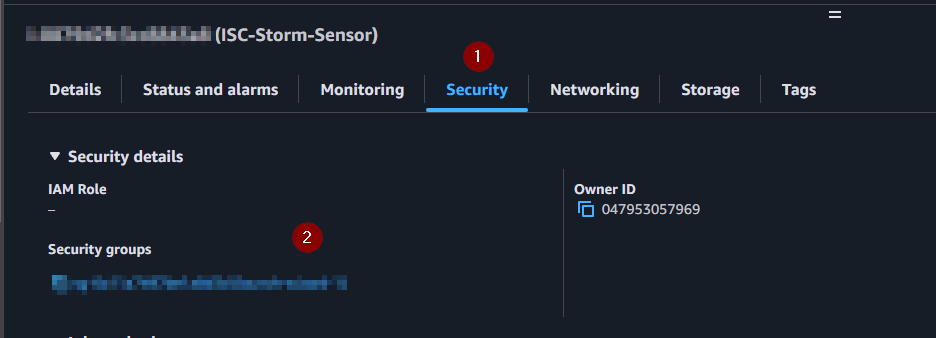
14) Click on <span style="color:cyan;">Edit inbound rules</span>. Here you will create two rules: 
    1) to allow ssh from your home subnet: Type:<span style="color:cyan;"> Cutom TCP</span>, Port range:<span style="color:cyan;">12222</span>, and Source:<span style="color:cyan;"> My IP</span>
    2)  to "harvest logs" from the big bad internet it up as : Type:<span style="color:cyan;"> ALL traffic</span>, Port range:<span style="color:cyan;">All</span>, and Source:<span style="color:cyan;"> Anywhere-IPv4</span>
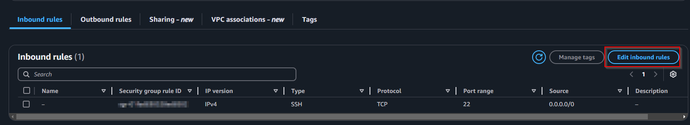
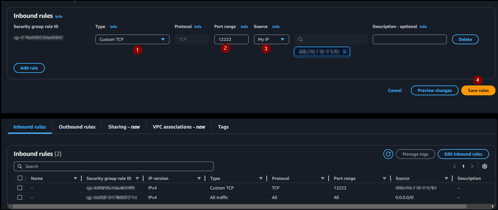
15) Rememeber the important scripts earlier? You should run <span style="color:cyan;"> status.sh</span> as sudo to check the settings. After sometime login to [dshield.org](https://dshield.org/) to check you logs out.
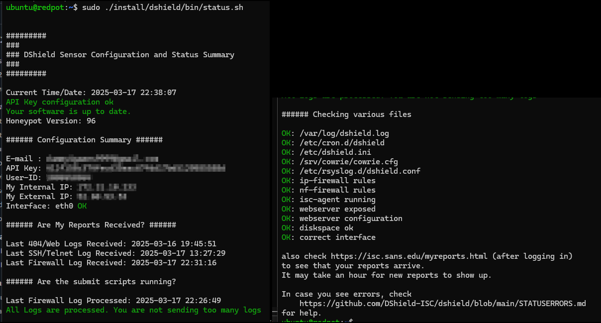
16) Some future head/wallet ache advise: search for <span style="color:cyan;">Billing and Cost Management</span> on the search bar. On the left hand side  under Cost Management click <span style="color:cyan;">Budgets</span> then <span style="color:cyan;">Create budget</span>. Use <span style="color:cyan;">Zero spend budget</span> template, add an <span style="color:cyan;">email recipient</span> to be notified when threshold is hit, and lastly scroll down to click <span style="color:cyan;">Create budget</span>. Should look like this after you set up. 
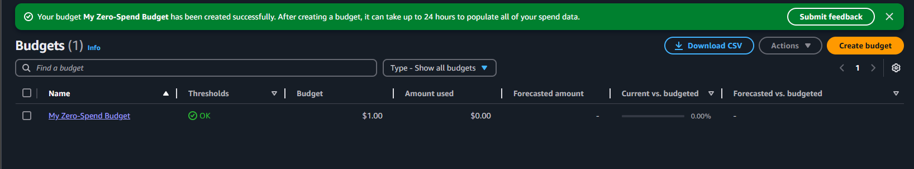
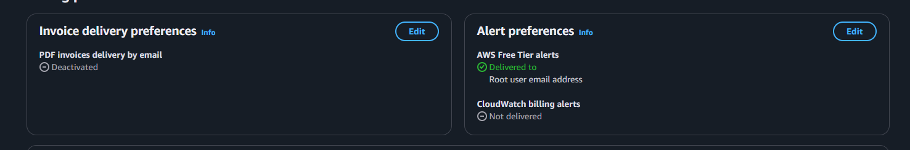


next [Setting up an ELK stack on another device for log analysis]()
# Resources:

Dr. Johannes Ullrich - https://www.youtube.com/watch?v=fMqhoNnyvmE

Dshield git page - https://github.com/DShield-ISC/dshield

Dshield website - https://dshield.org/

Guy Bruneau - https://github.com/bruneaug/DShield-SIEM?tab=readme-ov-file 

15HzMonitor - https://github.com/15HzMonitor/Internship-Blog-Post/blob/main/1.%20AWS%20DShield%20Sensor%20Setup.md
