# Dshield-Honeypot-AWS-setup
Write up on how to setup your Dshield honeypot on an AWS instance

****
ATTENTION: If you are here becuase of your raspberrypi install reports that your webserver is not exposed (like how mine was), please check this [guide](https://github.com/DShield-ISC/dshield/blob/main/docs/dshield-architecture/Architecture.md) first. =D
****

Fellow Sans.edu student or enthusiast, you will first need an AWS account to proceed. Registering for one will not be covered here, but here is a [link](https://docs.aws.amazon.com/lex/latest/dg/gs-account.html) to Amazon's documentation.

You will also need to register a [dshield account](https://dshield.org/) to have an API key and visibility of what you are forwarding to the Storm Center.

I was able to put this together by using instructions/guides from [Dr. Johannes Ullrich](https://www.youtube.com/watch?v=fMqhoNnyvmE) the founder of Internet Storm Center, [Guy Bruneau](https://github.com/bruneaug/DShield-SIEM?tab=readme-ov-file) my ISC handler, and [15HzMonitor](https://github.com/15HzMonitor/Internship-Blog-Post/blob/main/1.%20AWS%20DShield%20Sensor%20Setup.md) a fellow student (if you ever read this please correct me if I'm wrong)

****
1) After logging in and selecting your region, punch in ec2 in the search bar an click on click EC2 under Services. When re-directed, click Launch Instance

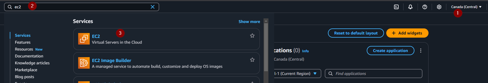
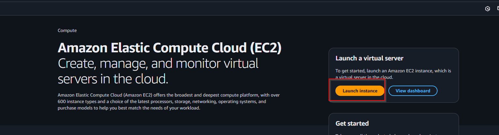

2) Pick a name for your instance. Choose Ubuntu for you OS, Ubuntu Server 22.04 LTS for the machine image, and t2.micro for instance type
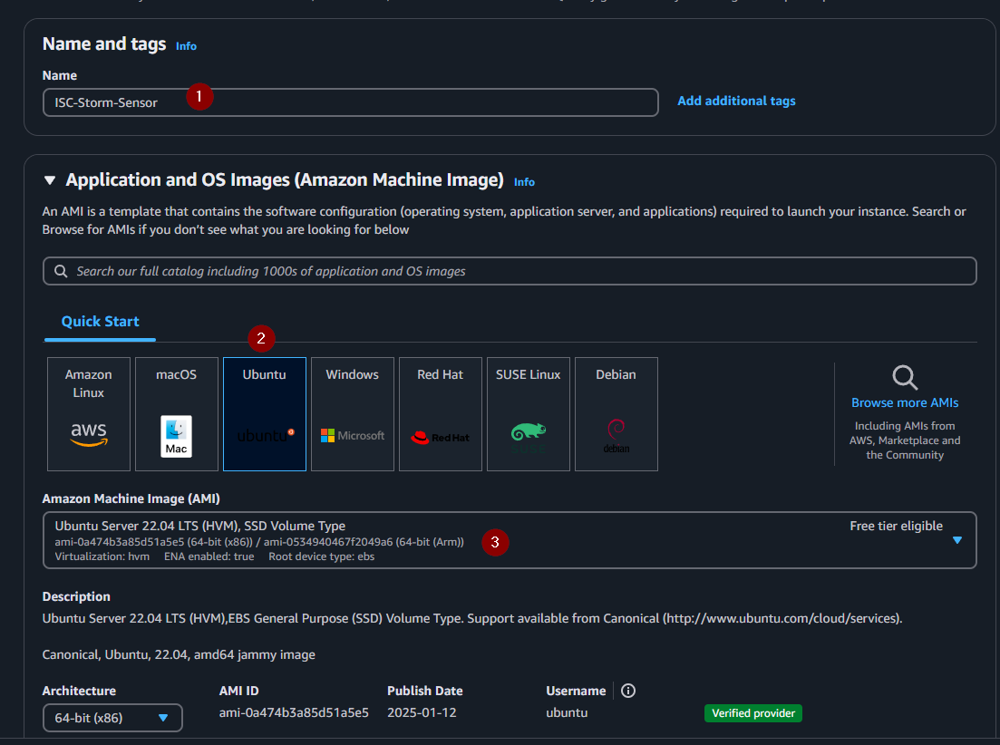
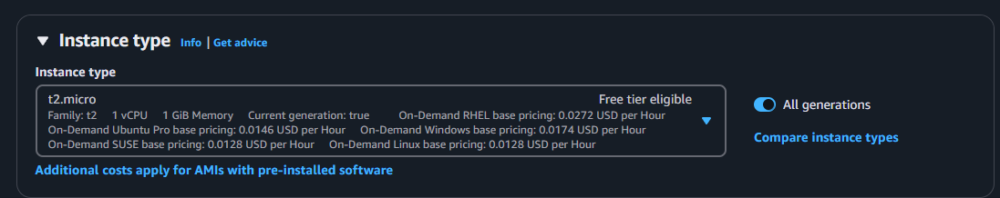
3) scroll down to see options on creating your ssh key. Click on  Create new key pair. Pick a Key pair name, RSA for key pair type, PEM for key file format and then click Create key pair. __Save it somewhere safe__ we'll use this shortly.
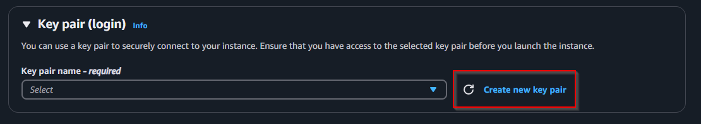
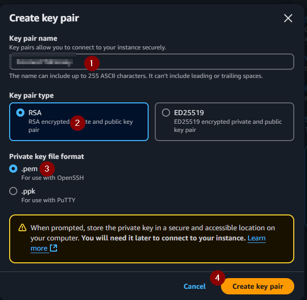
4) even further under Network settings, choose Create securtiy group and Allow SSH traffic (yes it says anywhere we'll deal with that in a bit)
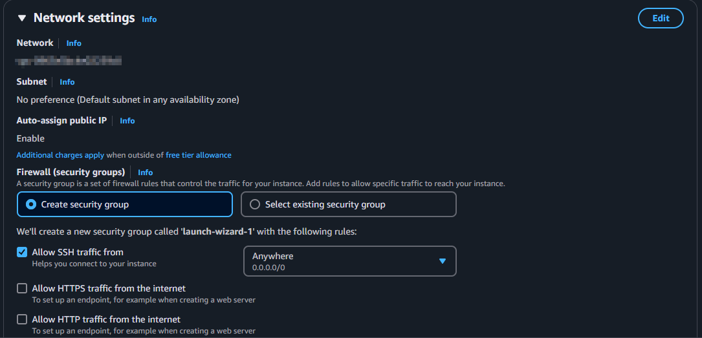
5) For storage  put in 30. You should see a message saying that this eligible for free tier customers
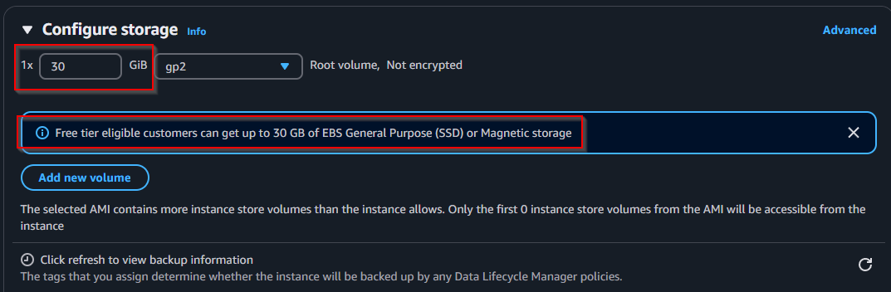
6) check the Summary and click Launch Instance. You should see a pop-up confimation.
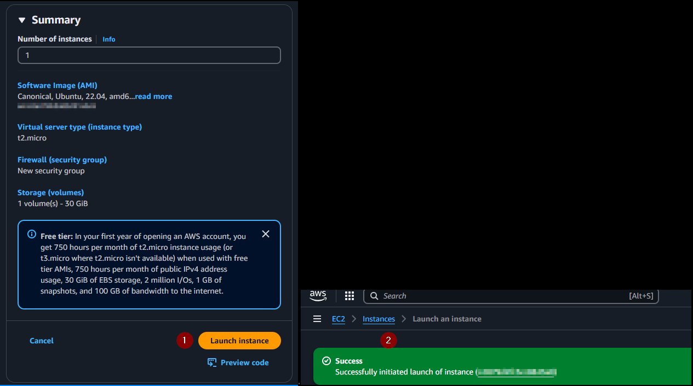
7) On the left handside click on Instances > tick box for your instnace >
 Public IPv4 address
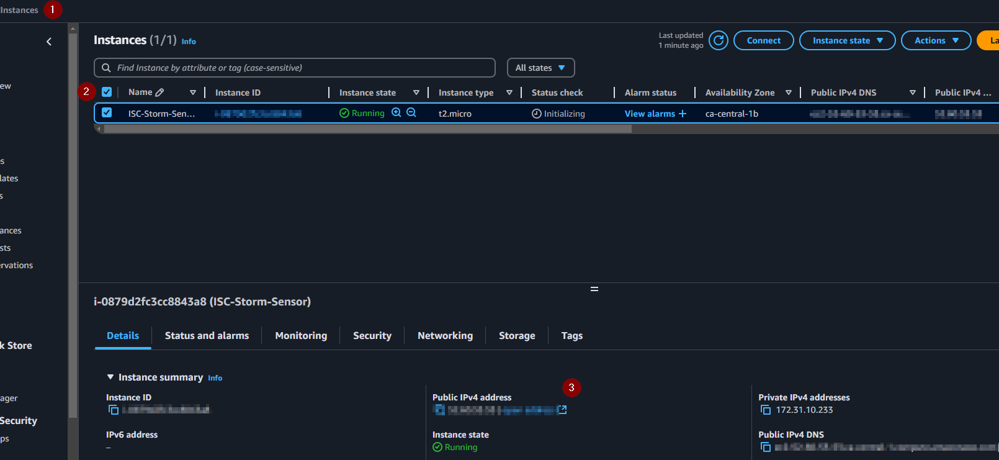

8) open a powershell on you pc and type in: 

  <pre style="background-color: #f4f4f4; padding: 10px; border-radius: 5px; max-width: 100%; overflow-x: auto;">
    <code id="codeBlock" style="white-space: pre-wrap;">
      ssh -i sshkey user@YourInstanceIP
    </code>
  </pre>
  <button onclick="copyToClipboard()" style="background-color: #4CAF50; color: white; padding: 5px 10px; border: none; border-radius: 3px; cursor: pointer;">
    Copy
  </button>

</script>

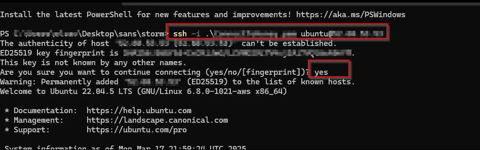